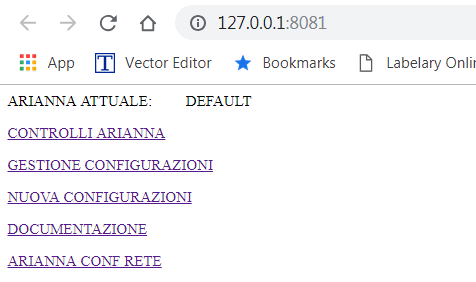
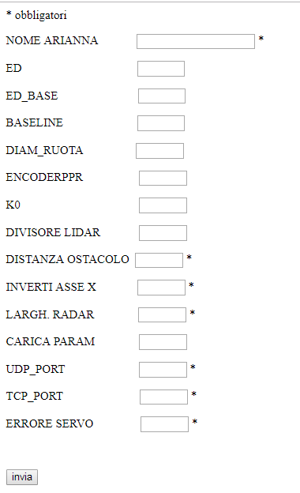
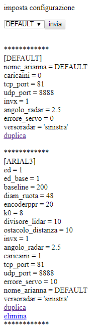
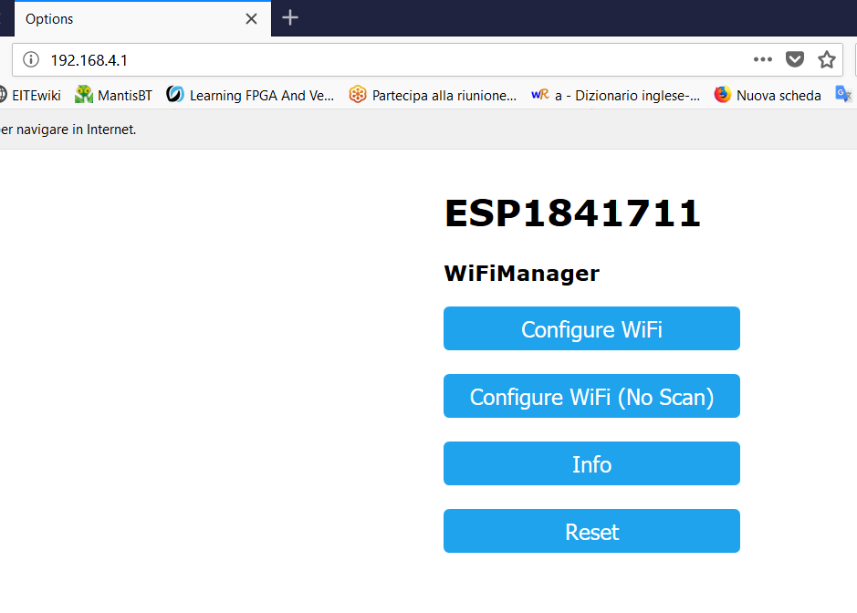
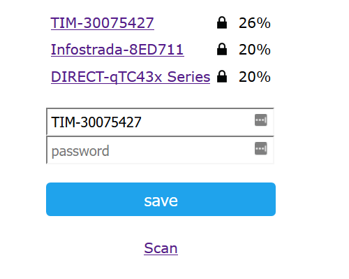

# installazione software su pc

[TOC]

#  

# Come è fatto

ARI è composto da una parte HW e FW, il robot ARI. ARI è composto da una scheda Arduino ATMEGA e da uno shield ARI_V3 fatto da StuffCube stuffcube.wordpress.com. Lo shield porta il controllo dei due motori, un ESP8266 per l'interfaccia col WiFi e funzioni accessori, l'interfaccia elettrica e i connettori verso i sensori ottici degli encoder e alle altre periferiche.

ci sono quindi due FW. Uno per l'ATMega e uno per l'ESP8266 (Wemmos mini D1). Questi si compilano e scaricano con l'ambiente Arduino. Una serie di librerie deve essere installata. elenco librerie ... da fare

Un software su pc è l'interfaccia con ARI. E' un server in python che offre una interfaccia web visualizzabile nel browser. richiede l'installazione di Python3 e di alcune librerie.

# Installazione Python

## Librerie Python

installa su Windows:

scaricare python 3.7 da [sito python ](http://https://www.python.org/downloads/release/python-371/ )  (versioni eventualmente supportate >=3.4 <4).
Installare python con le seguenti modifiche rispetto a quanto proposto:

* add python to path

* percorso installazione c:\python\python37.

  

installa su Linux:

*apt-get install python3_pip*

### modulo Tkinter

il 3.6 va sostituito dalla versione di python installata sul proprio computer, per conoscerla lanciare python3 da riga di comando

*apt-get install python3.6-tk*

### modulo Sympy

*pip3 install sympy*

### modulo Numpy

*pip3 install numpy*

### modulo Cherrypy

*pip3 install cherrypy*

 

##  Configurazione software

ARI_V3\01_pcSoftware\arianna_cli_socket2.0

Avviare Python e aprire il programma “arianna_clisocket.py”  con Arianna spenta, dopo qualche secondo si aprirà una pagina web con le seguenti opzioni

 ​                   

in alto indica il nome di Arianna che equivale alla configurazione che verrà usata (all'inizio vale 'default').

Aprire ora il link descritto come "nuova configurazione" e inserire i parametri fisici di arianna. Se non avete gia salvato i parametri di configurazione qui potete inserirli altrimenti è necessario inserire solo quelli identificati da asterisco (per le porte tcp e udp si raccomanda di usare 81 e 8888 se non ci sono esigenze particolari)

 ​        

 ricordate di inserire un nome alla configurazione, dopo aver premuto su invia tornate sul tab di scelta e andate all'opzione
 "gestione configurazioni" 

  ​      
  da qui potete correggere eventuali errori, duplicare configurazioni per testare parametri diversi o eliminari configurazioni non più utili, ma soprattutto potete scegliere dal menu in alto la configurazione da rendere attiva.

Riavviate il software e assicuratevi che la configurazione da voi scelta sia attiva.

Accendete Arianna se  la rete non è presente o non è stata ancora impostata il led blu sull’ESP lampeggia col periodo di un secondo (05 on, o5 off).
 L’eSP si configura come access point con il nome ESP.. seguito dal suo numero di serie, collegatevi a questa rete.

Nel menu di scelta andate su "ARIANNA CONF RETE".

​                   

Scegliendo “Configure WiFi” si ottiene la lista delle reti, selezionatene una, inserite la password  inserite il nome della caonfigurazione salvata ai passi precenti e come porta udp la stessa della configurazione
fate Save. Al riavvio si connetterà alla rete scelta.

 
 (rivedere immagine)

 Collegatevi alla stessa rete impostata su arianna e dal menu web scegliete "CONTROLLI ARIANNA" si aprirà quindi la finestra con i possibili comandi da inviare ad Arianna

   

 

